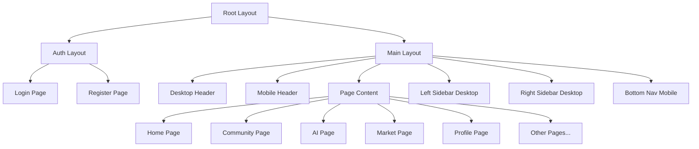

# Component Architecture & Breakdown

## 1. Component Hierarchy Overview

### Architecture Diagram



---

## 2. Layout Components

### 2.1 Root Layout

**File**: `src/app/layout.tsx`

**Purpose**: Wraps entire application, provides global context.

**Responsibilities**:
- Load global styles
- Provide theme context
- Include font optimization
- Set up React Query provider
- Include toast notifications
- Configure metadata

**Implementation**:

```typescript
import type { Metadata } from 'next';
import { Inter } from 'next/font/google';
import { Providers } from '@/components/providers';
import { Toaster } from '@/components/ui/sonner';
import './globals.css';

const inter = Inter({ subsets: ['latin'] });

export const metadata: Metadata = {
  title: {
    default: 'MoMent — Companion App for Moms & Families',
    template: '%s | MoMent',
  },
  description: 'Track appointments, vaccines, community support, AI Q&A, and more.',
  keywords: ['pregnancy', 'baby care', 'parenting', 'appointments', 'vaccines'],
};

export default function RootLayout({
  children,
}: {
  children: React.ReactNode;
}) {
  return (
    <html lang="en" suppressHydrationWarning>
      <body className={inter.className}>
        <Providers>
          {children}
          <Toaster />
        </Providers>
      </body>
    </html>
  );
}
```

---

### 2.2 Main Layout

**File**: `src/app/(main)/layout.tsx`

**Purpose**: Layout for authenticated main app pages.

**Responsibilities**:
- Desktop/mobile responsive layout
- Navigation components
- Sidebar management
- Protected route wrapper

**Component Tree**:

```
MainLayout
├── DesktopHeader
├── MobileHeader
├── div[main-grid]
│   ├── LeftSidebar (desktop only)
│   ├── main[page-content]
│   │   └── {children} (page content)
│   └── RightSidebar (desktop only)
└── BottomNav (mobile only)
```

**Implementation**:

```typescript
// src/app/(main)/layout.tsx
import { auth } from '@/lib/auth';
import { redirect } from 'next/navigation';
import { DesktopHeader } from '@/components/layout/desktop-header';
import { MobileHeader } from '@/components/layout/mobile-header';
import { BottomNav } from '@/components/layout/bottom-nav';
import { LeftSidebar } from '@/components/layout/left-sidebar';
import { RightSidebar } from '@/components/layout/right-sidebar';

export default async function MainLayout({
  children,
}: {
  children: React.ReactNode;
}) {
  const session = await auth();

  if (!session) {
    redirect('/login');
  }

  return (
    <div className="min-h-screen bg-slate-50">
      {/* Desktop Header */}
      <DesktopHeader className="hidden md:block" />

      {/* Mobile Header */}
      <MobileHeader className="md:hidden" user={session.user} />

      {/* Main Content Grid */}
      <div className="max-w-7xl mx-auto w-full md:px-6">
        <div className="md:grid md:grid-cols-12 md:gap-6">
          {/* Left Sidebar - Desktop Only */}
          <LeftSidebar className="hidden md:block md:col-span-3 lg:col-span-2 py-6" />

          {/* Page Content */}
          <main className="md:col-span-9 lg:col-span-7 px-4 md:px-0 py-4 md:py-6">
            {children}
          </main>

          {/* Right Sidebar - Desktop Only */}
          <RightSidebar className="hidden lg:block lg:col-span-3 py-6" />
        </div>
      </div>

      {/* Bottom Navigation - Mobile Only */}
      <BottomNav className="md:hidden" />
    </div>
  );
}
```

---

### 2.3 Desktop Header

**File**: `src/components/layout/desktop-header.tsx`

**Props**:
```typescript
interface DesktopHeaderProps {
  className?: string;
}
```

**Component Structure**:

```
DesktopHeader
├── Logo + Brand
├── Navigation Links
│   ├── NavLink (Home)
│   ├── NavLink (Community)
│   ├── NavLink (Ask AI)
│   ├── NavLink (Market)
│   └── NavLink (Profile)
├── SearchField
└── Notifications
    └── NotificationBell
```

**Implementation**:

```typescript
'use client';

import Link from 'next/link';
import { usePathname } from 'next/navigation';
import { SearchField } from '@/components/shared/search-field';
import { NotificationBell } from '@/components/shared/notification-bell';
import { Logo } from '@/components/shared/logo';
import { mainNavigation } from '@/config/navigation';
import { cn } from '@/lib/utils';

export function DesktopHeader({ className }: DesktopHeaderProps) {
  const pathname = usePathname();

  return (
    <header className={cn('sticky top-0 z-40 bg-white/80 backdrop-blur border-b', className)}>
      <div className="max-w-7xl mx-auto px-6 py-3 flex items-center gap-4">
        {/* Logo */}
        <Link href="/" className="flex items-center gap-2">
          <Logo className="w-9 h-9" />
          <span className="font-semibold">MoMent</span>
        </Link>

        {/* Navigation */}
        <nav className="flex items-center gap-1 text-sm">
          {mainNavigation.map((item) => (
            <Link
              key={item.href}
              href={item.href}
              className={cn(
                'px-3 py-2 rounded-xl flex items-center gap-2',
                pathname === item.href
                  ? 'bg-slate-100 text-violet-700 font-semibold'
                  : 'text-slate-700 hover:bg-slate-100'
              )}
            >
              <item.icon className="w-5 h-5" />
              {item.label}
            </Link>
          ))}
        </nav>

        {/* Right Section */}
        <div className="ml-auto flex items-center gap-3">
          <SearchField className="w-80" />
          <NotificationBell />
        </div>
      </div>
    </header>
  );
}
```

---

### 2.4 Mobile Header

**File**: `src/components/layout/mobile-header.tsx`

**Props**:
```typescript
interface MobileHeaderProps {
  className?: string;
  user: User;
}
```

**Component Structure**:

```
MobileHeader
├── MenuButton (opens drawer)
├── User Info
│   ├── Welcome Text
│   └── User Name + Baby Name
└── NotificationBell
```

---

### 2.5 Bottom Navigation (Mobile)

**File**: `src/components/layout/bottom-nav.tsx`

**Component Structure**:

```
BottomNav
├── NavItem (Home)
├── NavItem (Community)
├── NavItem (Ask AI - Featured/Centered)
├── NavItem (Market)
└── NavItem (Profile)
```

**shadcn/ui Component**: Use `NavigationMenu` component

---

### 2.6 Left Sidebar

**File**: `src/components/layout/left-sidebar.tsx`

**Component Structure**:

```
LeftSidebar
├── ProfileCard
│   ├── Avatar
│   ├── User Name
│   ├── Baby Info
│   └── Switch Family Button
└── QuickActionsCard
    ├── Button (Add reminder)
    ├── Button (Book visit)
    ├── Button (Log vaccine)
    └── Button (Write post)
```

---

### 2.7 Right Sidebar

**File**: `src/components/layout/right-sidebar.tsx`

**Component Structure**:

```
RightSidebar
├── UpcomingCard
│   ├── AppointmentItem[]
│   └── Add Appointment Button
└── BenefitsCTA
    ├── Title
    ├── Description
    └── Open Benefits Button
```

---

## 3. shadcn/ui Components

### 3.1 Core UI Components to Install

Run these commands to install shadcn/ui components:

```bash
npx shadcn-ui@latest init
npx shadcn-ui@latest add button
npx shadcn-ui@latest add card
npx shadcn-ui@latest add input
npx shadcn-ui@latest add textarea
npx shadcn-ui@latest add select
npx shadcn-ui@latest add dialog
npx shadcn-ui@latest add dropdown-menu
npx shadcn-ui@latest add avatar
npx shadcn-ui@latest add badge
npx shadcn-ui@latest add form
npx shadcn-ui@latest add toast
npx shadcn-ui@latest add tabs
npx shadcn-ui@latest add calendar
npx shadcn-ui@latest add popover
npx shadcn-ui@latest add label
npx shadcn-ui@latest add checkbox
npx shadcn-ui@latest add radio-group
npx shadcn-ui@latest add switch
npx shadcn-ui@latest add separator
npx shadcn-ui@latest add navigation-menu
npx shadcn-ui@latest add drawer
npx shadcn-ui@latest add carousel
```

### 3.2 Component Mapping

| HTML Element | shadcn/ui Component | Custom Wrapper |
|--------------|---------------------|----------------|
| `<button>` | `Button` | No |
| `<input>` | `Input` | `SearchField` |
| `<select>` | `Select` | No |
| `<textarea>` | `Textarea` | No |
| Modal | `Dialog` | No |
| Mobile Drawer | `Drawer` | No |
| Cards | `Card` | No |
| Avatar | `Avatar` | No |
| Badge | `Badge` | No |
| Carousel | `Carousel` | Yes (`ImageGallery`) |
| Bottom Nav | `NavigationMenu` | Yes (`BottomNav`) |
| Toast | `Sonner` (toast) | No |

---

## 4. Feature Components

### 4.1 Reminders Feature

**Component Tree**:

```
Reminders Feature
├── ReminderList
│   └── ReminderCard[]
│       ├── StatusDot (color-coded)
│       ├── Title
│       ├── DateTime
│       ├── Notes
│       └── Actions (Edit/Delete)
├── ReminderForm (Dialog)
│   ├── Input (Title)
│   ├── DateTimePicker
│   ├── Textarea (Notes)
│   ├── Select (Category)
│   └── FormActions (Cancel/Save)
└── AddReminderButton
```

**Files**:
- `src/components/features/reminders/reminder-list.tsx`
- `src/components/features/reminders/reminder-card.tsx`
- `src/components/features/reminders/reminder-form.tsx`
- `src/components/features/reminders/add-reminder-button.tsx`

**Example: ReminderCard**

```typescript
// src/components/features/reminders/reminder-card.tsx
import { format } from 'date-fns';
import { Card } from '@/components/ui/card';
import { Badge } from '@/components/ui/badge';
import { Button } from '@/components/ui/button';
import { type Reminder } from '@/types';

interface ReminderCardProps {
  reminder: Reminder;
  onEdit?: (reminder: Reminder) => void;
  onDelete?: (id: string) => void;
}

const categoryColors = {
  appointment: 'bg-amber-500',
  vaccine: 'bg-emerald-500',
  wellness: 'bg-blue-500',
  task: 'bg-slate-500',
};

export function ReminderCard({ reminder, onEdit, onDelete }: ReminderCardProps) {
  return (
    <Card className="flex items-center gap-3 p-3">
      {/* Status Dot */}
      <span
        className={`w-2 h-2 rounded-full ${categoryColors[reminder.category]}`}
        aria-hidden="true"
      />

      {/* Content */}
      <div className="flex-1">
        <p className="text-sm font-medium">{reminder.title}</p>
        <p className="text-xs text-slate-500">
          {format(new Date(reminder.when), 'MMM d, HH:mm')}
          {reminder.note && ` · ${reminder.note}`}
        </p>
      </div>

      {/* Actions */}
      <div className="flex gap-1">
        {onEdit && (
          <Button size="icon" variant="ghost" onClick={() => onEdit(reminder)}>
            <EditIcon className="w-4 h-4" />
          </Button>
        )}
        {onDelete && (
          <Button
            size="icon"
            variant="ghost"
            onClick={() => onDelete(reminder.id)}
          >
            <TrashIcon className="w-4 h-4" />
          </Button>
        )}
      </div>
    </Card>
  );
}
```

---

### 4.2 Community Feature

**Component Tree**:

```
Community Feature
├── PostGrid
│   └── PostCard[]
│       ├── CategoryBadge
│       ├── AuthorInfo
│       │   ├── Avatar
│       │   └── Name + Badge
│       ├── Title
│       ├── Excerpt
│       ├── ImagePreview (if images)
│       └── Stats (Likes/Comments)
├── CategoryFilter
│   └── FilterPill[] (multi-select)
├── PostComposer (Dialog)
│   ├── Input (Title)
│   ├── Textarea (Content)
│   ├── Select (Category)
│   ├── Input (Tags)
│   ├── ImageUploader (multiple)
│   └── FormActions
├── PostDetail (Dialog)
│   ├── Header
│   ├── ImageGallery (Carousel)
│   ├── Content
│   ├── Stats
│   └── Comments (future)
└── SearchBar
```

**Files**:
- `src/components/features/community/post-grid.tsx`
- `src/components/features/community/post-card.tsx`
- `src/components/features/community/post-composer.tsx`
- `src/components/features/community/post-detail.tsx`
- `src/components/features/community/category-filter.tsx`

**Example: PostCard**

```typescript
// src/components/features/community/post-card.tsx
import Image from 'next/image';
import { Card } from '@/components/ui/card';
import { Badge } from '@/components/ui/badge';
import { Avatar, AvatarImage, AvatarFallback } from '@/components/ui/avatar';
import { type CommunityPost } from '@/types';

interface PostCardProps {
  post: CommunityPost;
  onClick?: () => void;
}

export function PostCard({ post, onClick }: PostCardProps) {
  return (
    <Card
      className="p-4 hover:shadow-lg transition cursor-pointer"
      onClick={onClick}
    >
      {/* Header */}
      <div className="flex items-center gap-2 text-xs text-slate-500 mb-2">
        <Badge variant="secondary">{post.category}</Badge>
        <span>{formatRelativeTime(post.createdAt)}</span>
      </div>

      {/* Author */}
      <div className="flex items-center gap-2 mb-2">
        <Avatar className="w-8 h-8">
          <AvatarImage src={post.author.avatar} alt={post.author.name} />
          <AvatarFallback>{post.author.name[0]}</AvatarFallback>
        </Avatar>
        <div>
          <p className="text-sm font-semibold">{post.author.name}</p>
          <p className="text-xs text-slate-500">{post.author.badge}</p>
        </div>
      </div>

      {/* Content */}
      <h4 className="font-semibold mb-1">{post.title}</h4>
      <p className="text-sm text-slate-600 line-clamp-3">{post.content}</p>

      {/* Images */}
      {post.images.length > 0 && (
        <div className="mt-3 grid grid-cols-3 gap-1 rounded-xl overflow-hidden">
          {post.images.slice(0, 3).map((img, idx) => (
            <div key={idx} className="aspect-[4/3] bg-slate-200 relative">
              <Image
                src={img}
                alt={`${post.title} image ${idx + 1}`}
                fill
                className="object-cover"
              />
            </div>
          ))}
        </div>
      )}

      {/* Stats */}
      <div className="mt-3 flex gap-4 text-sm text-slate-500">
        <span>👍 {post.likes}</span>
        <span>💬 {post.comments}</span>
      </div>
    </Card>
  );
}
```

---

### 4.3 AI Chat Feature

**Component Tree**:

```
AI Chat Feature
├── ChatContainer
│   ├── ChatHeader
│   ├── MessageList
│   │   └── ChatBubble[]
│   │       ├── Avatar
│   │       ├── Message Content
│   │       ├── Citations (AI only)
│   │       └── Actions (Copy/Regenerate)
│   └── ChatInput
│       ├── AttachButton
│       ├── VoiceButton
│       ├── Textarea
│       ├── SendButton
│       └── SmartChips
├── QuickPromptsPanel (Sidebar)
│   └── PromptButton[]
└── ContextModePanel (Sidebar)
    ├── RadioGroup (Pregnancy/Postpartum)
    └── Input (Age input)
```

**Files**:
- `src/components/features/ai/chat-container.tsx`
- `src/components/features/ai/chat-bubble.tsx`
- `src/components/features/ai/chat-input.tsx`
- `src/components/features/ai/quick-prompts.tsx`
- `src/components/features/ai/context-mode.tsx`

**Example: ChatBubble**

```typescript
// src/components/features/ai/chat-bubble.tsx
import { Avatar, AvatarFallback } from '@/components/ui/avatar';
import { Button } from '@/components/ui/button';
import { Badge } from '@/components/ui/badge';
import { type ChatMessage } from '@/types';
import { cn } from '@/lib/utils';

interface ChatBubbleProps {
  message: ChatMessage;
  onCopy?: (text: string) => void;
  onRegenerate?: (message: ChatMessage) => void;
}

export function ChatBubble({ message, onCopy, onRegenerate }: ChatBubbleProps) {
  const isUser = message.from === 'user';

  return (
    <div
      className={cn(
        'flex items-start gap-3',
        isUser ? 'justify-end' : 'justify-start'
      )}
    >
      {!isUser && (
        <Avatar className="w-8 h-8 bg-violet-600">
          <AvatarFallback className="text-white">AI</AvatarFallback>
        </Avatar>
      )}

      <div
        className={cn(
          'rounded-2xl px-3 py-2 max-w-[78%]',
          isUser
            ? 'bg-violet-600 text-white rounded-tr-md'
            : 'bg-slate-100 rounded-tl-md'
        )}
      >
        <p className="text-sm whitespace-pre-wrap">{message.text}</p>

        {/* Attachment */}
        {message.attachName && (
          <div className="mt-2 text-xs bg-white/20 rounded-md px-2 py-1">
            Attachment: {message.attachName}
          </div>
        )}

        {/* Citations (AI only) */}
        {!isUser && message.citations && message.citations.length > 0 && (
          <div className="mt-2 flex flex-wrap gap-2">
            {message.citations.map((citation, idx) => (
              <Badge key={idx} variant="outline" className="text-[11px]">
                {citation}
              </Badge>
            ))}
          </div>
        )}

        {/* Actions (AI only) */}
        {!isUser && (
          <div className="mt-2 flex items-center gap-2 text-xs text-slate-500">
            {onCopy && (
              <Button
                size="sm"
                variant="outline"
                onClick={() => onCopy(message.text)}
              >
                Copy
              </Button>
            )}
            {onRegenerate && (
              <Button
                size="sm"
                variant="outline"
                onClick={() => onRegenerate(message)}
              >
                Regenerate
              </Button>
            )}
          </div>
        )}
      </div>

      {isUser && (
        <Avatar className="w-8 h-8 bg-slate-300">
          <AvatarFallback>Me</AvatarFallback>
        </Avatar>
      )}
    </div>
  );
}
```

---

### 4.4 Marketplace Feature

**Component Tree**:

```
Market Feature
├── ProductGrid
│   └── ProductCard[]
│       ├── Image
│       ├── ConditionBadge
│       ├── Title
│       ├── Description
│       ├── Price
│       ├── Location
│       └── TimeAgo
├── FiltersPanel
│   ├── SearchInput
│   ├── CategoryFilter
│   ├── ConditionCheckboxes
│   ├── PriceRange
│   └── SortSelect
├── ProductForm (Dialog)
│   ├── Input (Title)
│   ├── Select (Category)
│   ├── Select (Condition)
│   ├── Input (Price)
│   ├── Input (Location)
│   ├── Textarea (Description)
│   ├── ImageUploader (up to 5)
│   └── FormActions
├── ProductDetail (Dialog)
│   ├── ImageGallery
│   ├── ProductInfo
│   │   ├── Title
│   │   ├── ConditionBadge
│   │   ├── Price
│   │   ├── Location
│   │   └── Description
│   └── Actions
│       ├── Message Seller Button
│       └── Save Button
└── Pagination
```

**Files**:
- `src/components/features/market/product-grid.tsx`
- `src/components/features/market/product-card.tsx`
- `src/components/features/market/product-form.tsx`
- `src/components/features/market/product-detail.tsx`
- `src/components/features/market/filters-panel.tsx`

---

### 4.5 Profile Feature

**Component Tree**:

```
Profile Feature
├── ProfileSection
│   ├── PhotoUploader
│   ├── Input (Name)
│   ├── Input (Email)
│   ├── Input (Phone)
│   ├── Input (Hospital)
│   └── FormActions
├── ChildrenSection
│   ├── ChildCard[]
│   │   ├── PhotoUploader
│   │   ├── Input (Name)
│   │   ├── DatePicker (Birth Date)
│   │   ├── Select (Gender)
│   │   ├── Input (Blood Type)
│   │   ├── Input (Allergies)
│   │   ├── Input (Primary Doctor)
│   │   └── CardActions (Remove/Save)
│   └── AddChildButton
├── HospitalConnect
│   ├── SearchInput
│   └── LinkButton
├── NotificationSettings
│   ├── Checkbox (Push)
│   ├── Checkbox (Email)
│   └── FormActions
├── CaregiverInvite
│   ├── Input (Email)
│   └── SendButton
└── SecuritySection
    ├── Input (Current Password)
    ├── Input (New Password)
    ├── Input (Confirm Password)
    └── FormActions
```

**Files**:
- `src/components/features/profile/profile-form.tsx`
- `src/components/features/profile/child-card.tsx`
- `src/components/features/profile/photo-uploader.tsx`
- `src/components/features/profile/hospital-connect.tsx`
- `src/components/features/profile/notification-settings.tsx`

---

## 5. Shared Components

### 5.1 ImageUploader

**Purpose**: Reusable image upload with preview.

**Props**:
```typescript
interface ImageUploaderProps {
  maxImages?: number;
  onUpload: (files: File[]) => void;
  previews?: string[];
  onRemove?: (index: number) => void;
}
```

**Implementation**:

```typescript
// src/components/shared/image-uploader.tsx
'use client';

import { useState } from 'react';
import Image from 'next/image';
import { Button } from '@/components/ui/button';
import { X, Upload } from 'lucide-react';

export function ImageUploader({
  maxImages = 5,
  onUpload,
  previews = [],
  onRemove,
}: ImageUploaderProps) {
  const [localPreviews, setLocalPreviews] = useState<string[]>(previews);

  const handleFileChange = (e: React.ChangeEvent<HTMLInputElement>) => {
    const files = Array.from(e.target.files || []).slice(0, maxImages);

    // Generate previews
    const newPreviews: string[] = [];
    files.forEach((file) => {
      const reader = new FileReader();
      reader.onload = (e) => {
        newPreviews.push(e.target?.result as string);
        if (newPreviews.length === files.length) {
          setLocalPreviews([...localPreviews, ...newPreviews].slice(0, maxImages));
        }
      };
      reader.readAsDataURL(file);
    });

    onUpload(files);
  };

  const handleRemove = (index: number) => {
    const updated = localPreviews.filter((_, i) => i !== index);
    setLocalPreviews(updated);
    onRemove?.(index);
  };

  return (
    <div>
      {/* Upload Button */}
      <label className="flex items-center gap-2 px-4 py-2 border rounded-xl cursor-pointer hover:bg-slate-50">
        <Upload className="w-5 h-5" />
        <span>Upload images</span>
        <input
          type="file"
          accept="image/*"
          multiple
          className="hidden"
          onChange={handleFileChange}
        />
      </label>

      {/* Previews */}
      {localPreviews.length > 0 && (
        <div className="mt-3 grid grid-cols-4 gap-2">
          {localPreviews.map((src, idx) => (
            <div key={idx} className="relative">
              <div className="aspect-square relative rounded-lg overflow-hidden border">
                <Image src={src} alt={`Preview ${idx + 1}`} fill className="object-cover" />
              </div>
              <Button
                size="icon"
                variant="destructive"
                className="absolute -top-2 -right-2 w-6 h-6 rounded-full"
                onClick={() => handleRemove(idx)}
              >
                <X className="w-4 h-4" />
              </Button>
            </div>
          ))}
        </div>
      )}
    </div>
  );
}
```

---

### 5.2 SearchField

**Purpose**: Search input with icon.

**shadcn/ui base**: `Input`

**Props**:
```typescript
interface SearchFieldProps {
  placeholder?: string;
  value?: string;
  onChange?: (value: string) => void;
  className?: string;
}
```

---

### 5.3 LoadingSpinner

**Purpose**: Consistent loading indicator.

**Implementation**: Use `lucide-react` `Loader2` icon with animation.

---

## 6. Component Props Pattern

### TypeScript Interface Pattern

```typescript
// Base props with common patterns
interface BaseComponentProps {
  className?: string;
  children?: React.ReactNode;
}

// Feature component props
interface FeatureProps extends BaseComponentProps {
  data: DataType;
  onAction?: (item: DataType) => void;
  isLoading?: boolean;
  error?: Error | null;
}

// Form component props
interface FormProps {
  defaultValues?: Partial<FormData>;
  onSubmit: (data: FormData) => void | Promise<void>;
  isSubmitting?: boolean;
  onCancel?: () => void;
}
```

---

## 7. Accessibility Requirements

### ARIA Implementation

```typescript
// Example: Accessible Modal
<Dialog>
  <DialogTrigger asChild>
    <Button aria-label="Add reminder">Add</Button>
  </DialogTrigger>
  <DialogContent aria-labelledby="dialog-title" aria-describedby="dialog-description">
    <DialogHeader>
      <DialogTitle id="dialog-title">Add Reminder</DialogTitle>
      <DialogDescription id="dialog-description">
        Create a new reminder for appointments or tasks
      </DialogDescription>
    </DialogHeader>
    {/* Form content */}
  </DialogContent>
</Dialog>
```

### Keyboard Navigation

- All interactive elements must be keyboard accessible
- Tab order should be logical
- Focus states must be visible
- Escape key closes modals
- Enter key submits forms

---

## Next Steps

Proceed to:
- **04-styling-migration.md** - CSS to Tailwind strategy
- **05-implementation-roadmap.md** - Phase-by-phase plan
